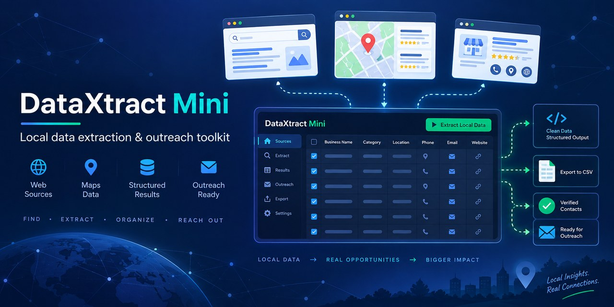
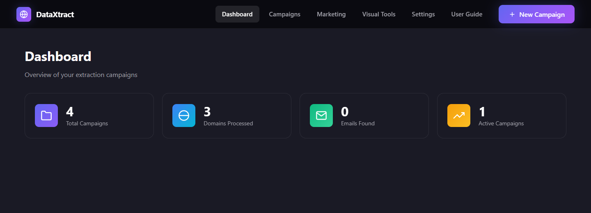

# DataXtract Mini

<p align="center">
  
</p>

<p align="center">
  <a href="https://github.com/99proteam/DataXtract-Mini/actions/workflows/ci.yml"></a>
  <a href="https://github.com/99proteam/DataXtract-Mini/releases"></a>
  
  
</p>

**DataXtract Mini** is a self-hosted Node.js toolkit for turning public web and map data into structured, exportable leads. It combines Google Maps and domain extraction, lead verification, bulk screenshots, code download, authorized traffic testing, and authenticated outreach integrations in one local dashboard.

- Runs locally on Windows, macOS, and Linux
- Installs and starts with one command
- Exports structured results without requiring a hosted account
- Keeps application data and integration settings on your computer
- Requires no login, user account, or authentication setup; it binds to your own computer by default

> If DataXtract Mini saves you time, consider [starring the repository](https://github.com/99proteam/DataXtract-Mini) so more developers can discover it.

## Feature highlights

| Area | Capabilities |
|---|---|
| Lead discovery | Google Maps searches, domain crawling, contact and social-link extraction |
| Lead quality | MX checks, optional ZeroBounce validation, WhatsApp number checks, lead scoring |
| Research | Technology detection, metadata, media, LinkedIn extraction, rendered-page support |
| Visual tools | Bulk screenshots, static/rendered source download, authorized traffic testing |
| Outreach | SMTP email, Twilio SMS, WhatsApp Web, scheduling, personalization |
| Operations | CSV/JSON/Excel export, proxy rotation, browser detection, local SQLite storage |

## Preview

<p align="center">
  
</p>

The dashboard provides a single place to start extraction jobs, review activity, configure integrations, and open the included user guide.

## Requirements

- Windows, macOS, or Linux
- Node.js 18 or newer (Node.js 20 LTS recommended)
- npm
- Google Chrome or Microsoft Edge
- 4 GB RAM recommended

## Quick start

### Option A: Downloaded or transferred folder

1. Install [Node.js](https://nodejs.org/) 18 or newer.
2. Install Chrome or Microsoft Edge.
3. Extract/copy the complete project folder.
4. Open Terminal or PowerShell inside that folder.
5. Run this one command:

   ```bash
   npm run deploy
   ```

6. Open **http://127.0.0.1:3007**.

The command installs all dependencies and starts the server. For later starts, use `npm start`.

### Option B: Clone from GitHub

```bash
git clone https://github.com/99proteam/DataXtract-Mini.git
cd DataXtract-Mini
npm run deploy
```

## First-time configuration

1. Open **http://127.0.0.1:3007**.
2. Select **Settings**.
3. Configure only the integrations you intend to use:

| Integration | Required for |
|---|---|
| SMTP host, port, username, password | Email campaigns |
| Twilio Account SID, auth token, sender number | SMS campaigns |
| Webshare/custom proxies | Optional proxy rotation |
| ZeroBounce API key | Optional ZeroBounce email checks |
| OpenAI or Gemini key | Optional AI features |

Settings are stored locally in `data/settings.json`. Do not publish or share that file after adding real credentials. Application data is stored in `data/extractor.db`; the root-level `data.db` file is not used.

## How to use each tool

### Google Maps extraction

1. Click **New Campaign** and select **Google Maps**.
2. Enter one search per line, such as `dentists in Hyderabad`.
3. Choose the result limit, details option, user-agent rotation, and delay.
4. Create the campaign and click **Start**.
5. Review live results and export them when complete.

If a configured proxy is unreachable, the extractor automatically retries through the direct connection.

### Domain extraction

1. Prepare domains or website links, one per line. You can paste them directly or use a TXT, CSV, or XLSX file.
2. Click **New Campaign**, select **Domain Extraction**, and paste or upload the list.
3. Choose emails, phones, technology, social links, metadata, media, and crawl depth.
4. Create and start the campaign.
5. Export the grouped results as CSV, JSON, or Excel.

Example input:

```text
example.com
company.example
```

Downloadable safe examples:

- [Domain input (TXT)](examples/domain-input.txt)
- [Lead verification input (CSV)](examples/lead-verification.csv)
- [Anonymized export (CSV)](examples/export-results.csv)
- [Anonymized export (JSON)](examples/export-results.json)

### Verify leads

1. Open **Verify Leads**.
2. Upload or paste email addresses/phone numbers.
3. Select a verification method.
4. Run verification and export valid or invalid results.

MX email verification works without an API key. ZeroBounce requires its API key. WhatsApp-number verification requires an active, logged-in WhatsApp session.

### SMS campaign

1. Configure Twilio under **Settings**.
2. Open **SMS Campaign** and upload recipients.
3. Write the message and optionally use personalization fields such as `{{name}}`.
4. Test with one controlled number.
5. Start the campaign and review sent/failed results.

### Email campaign

1. Configure and test SMTP under **Settings**.
2. Open **Email Campaign** and upload recipients.
3. Add the subject, HTML/text content, sender details, and attachments.
4. Send a test email first.
5. Start the campaign and review the results.

### WhatsApp Web

1. Open **WhatsApp Web** and add a session name.
2. Start the session and scan the displayed QR code with WhatsApp.
3. Wait until the session shows as logged in.
4. Upload recipients, prepare the message, and run the campaign.

The session is stored locally so it can be reused until WhatsApp expires it.

### LinkedIn

1. Open **LinkedIn** and start a named session.
2. Log in manually in the Chrome window that opens.
3. Return to DataXtract Mini and click **Confirm Login**.
4. Use people, company, profile, or job extraction.

LinkedIn may show verification challenges. Complete them manually and use reasonable request limits.

### Bulk Screenshots

1. Open **Tools → Bulk Screenshots**.
2. Paste URLs directly or import a TXT, CSV, or XLSX URL list.
3. Select desktop, laptop, tablet, or mobile viewports.
4. Start the job and download the generated PNG files.

Completed or paused campaigns can be reset with **Restart**. Restart clears the old result rows, keeps the source domains/keywords, and places every source item back in the pending queue.

### Code Downloader

1. Open **Tools → Code Downloader**.
2. Enter or upload URLs.
3. Select static HTML or rendered JavaScript mode.
4. Start the download and collect the generated HTML files.

### Website traffic testing

1. Open **Visual Tools → Website Traffic Tester**.
2. Enter URLs you own or are authorized to test, or import them from TXT, CSV, or XLSX.
3. Choose visit count, device, duration, human simulation, and optional proxies.
4. Start the job and review the activity log.

## Useful commands

| Command | Purpose |
|---|---|
| `npm run deploy` | Install dependencies and start the application |
| `npm start` | Start an already-installed copy |
| `npm run dev` | Start the development server |
| `npm test` | Run automated integrity tests |

`npm test` includes isolated API smoke tests. They create temporary data and settings paths, do not use your local database, and never contact third-party services.

## Troubleshooting

- **Port already in use:** close the other DataXtract/Node process and run `npm start` again.
- **Chrome does not open:** install or update Chrome/Edge, or set `PUPPETEER_EXECUTABLE_PATH` to a working browser executable.
- **SMS/Email reports configuration errors:** complete Twilio or SMTP settings before sending.
- **WhatsApp/LinkedIn is not ready:** start a session and finish the manual login first.
- **Proxy connection failed:** disable/remove dead proxies; Maps and domain extraction also retry directly.
- **Database locked:** close external database viewers while a campaign is writing data.

More documentation: [Installation](docs/INSTALLATION.md), [User Guide](docs/USER_GUIDE.md), [Changelog](docs/CHANGELOG.md), and [License](LICENSE).

## Architecture

```text
Browser dashboard
      |
Express API routes
      |
Extraction, verification, outreach, and browser services
      |
Local SQLite database + local settings
```

The application is intentionally self-hosted. Optional providers such as Twilio, SMTP, ZeroBounce, OpenAI, Gemini, Webshare, WhatsApp, and LinkedIn are only contacted when their related features are configured and used.

## Responsible use

DataXtract Mini is intended for legitimate research, data portability, testing, and permission-based outreach.

- Only collect information you are legally permitted to access and process.
- Respect website terms, robots directives, rate limits, privacy laws, and platform rules.
- Send email, SMS, WhatsApp, or LinkedIn messages only when you have the required consent or another valid legal basis.
- Use the traffic tester only on websites you own or are explicitly authorized to test.
- Never use the project for credential theft, access-control bypass, harassment, spam, deceptive engagement, or service disruption.

You are responsible for how you configure and operate the software. See [SECURITY.md](SECURITY.md) for reporting vulnerabilities.

## Contributing

Contributions are welcome. Start with [CONTRIBUTING.md](CONTRIBUTING.md), browse the [open issues](https://github.com/99proteam/DataXtract-Mini/issues), or choose an issue marked [`good first issue`](https://github.com/99proteam/DataXtract-Mini/labels/good%20first%20issue).

For support questions and feature ideas, use [GitHub Discussions](https://github.com/99proteam/DataXtract-Mini/discussions). The planned direction is documented in the [roadmap](docs/ROADMAP.md).

## Take the next step with BundleWP Premium

<p align="center">
  <strong>Turn the free toolkit into a complete business workflow.</strong><br>
  Premium BundleWP products cover lead generation, outreach, finance, billing, WooCommerce automation, web tools, and multi-platform research.
</p>

> **Save 50%:** use coupon `SAVE50` at checkout. [Browse every BundleWP product →](https://bundlewp.com/shop/)

| Premium product | Best for | What it helps you do | Get it |
|---|---|---|---|
| **Auto Lead Pilot AI** | Complete lead-to-customer operations | Run lead generation, CRM, campaigns, customer engagement, Google integrations, website utilities, and team productivity from one solution. | **[View plans →](https://bundlewp.com/product/auto-lead-pilot-ai/)** |
| **DataXtract Pro** | Growing extraction and outreach teams | Find and organize business leads, manage extraction campaigns, enrich contacts, and coordinate outreach workflows. | **[Buy now →](https://bundlewp.com/product/dataxtract-pro/)** |
| **All In One Smart Extractor** | Multi-platform business research | Research Google Maps, websites, search, social networks, Trustpilot, Reddit, GitHub, Flipkart, Telegram, and online marketplaces from Windows. | **[Buy now →](https://bundlewp.com/product/all-in-one-smart-extractor/)** |
| **Billify** | Inventory, billing, and point of sale | Manage products, invoices, sales, customers, suppliers, stock alerts, reports, and barcode workflows on Windows. | **[Buy now →](https://bundlewp.com/product/billify-smart-inventory-billing-and-pos-windows-software/)** |
| **WooFlow Manager** | WooCommerce store automation | Control orders, automate products and rewards, recover sales, build reports, export records, and deliver licenses. | **[Buy now →](https://bundlewp.com/product/wooflow-manager-store-automation-toolkit-for-woocommerce/)** |
| **Fin Tools** | Launching a utility-tools website | Publish 100+ finance, PDF, image, developer, text, converter, and network tools as a WordPress website. | **[Buy now →](https://bundlewp.com/product/fin-tools-100-premium-web-tools-for-wordpress/)** |
| **Pro Fin Suite** | Everyday business productivity | Use finance, office, media, security, marketing, business-management, and system utilities in one Windows suite. | **[Buy now →](https://bundlewp.com/product/pro-fin-suite/)** |

<p align="center">
  <a href="https://bundlewp.com/shop/"><strong>Explore the complete BundleWP catalog →</strong></a>
</p>

Coupon availability and product pricing can change; confirm the current offer on BundleWP before purchase.

## Support and license

- Website: https://bundlewp.com
- Email: support@bundlewp.com
- Open-source license detected by GitHub: [MIT License](LICENSE)
- Commercial BundleWP products may use separate licensing terms.

© 2026 BundleWP. All rights reserved.
